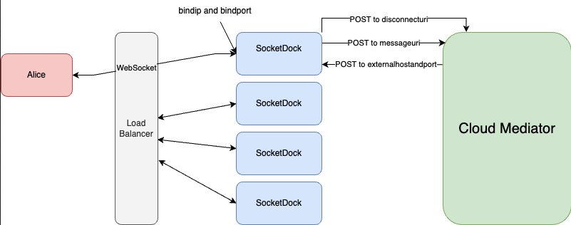

# SocketDock

A WebSocket relay for an HTTP-only backend

SocketDock serves as a relay between WebSocket-oriented agents and HTTP-only backend. Arbitrarily many instances of SocketDock can be spun up behind a load balancer, which serves WebSocket connections to a specific instance of SocketDock. SocketDock will receive messages addressed to the backend and transport them across HTTP to the backend. No preprocessing is done, but messages are forwarded with some additional metadata to allow the backend to associate the sender of the message with the SocketDock instance it's connected to.

When a WebSocket is terminated, SocketDock will send a message to the `disconnecturi`, informing the backend that the connection has been terminated.



## Configuration
### `bindip` and `bindport`
These reference what the instance of SocketDock is running on. These are primarily important for the load balancer, so it knows where to serve WebSocket connections.

### `messageuri`
This is the HTTP endpoint of whatever backend that SocketDock is in front of. SocketDock will pass messages, along with some metadata, to this endpoint.

```json=
{
    "meta": {
                "connection_id": <socket_id>,
                "send": "http://<externalhostandport>/socket/<socket_id>/send",
            }, 
    "message": message
}
```
### `disconnecturi`
When a WebSocket is terminated, SocketDock will inform the backend of the disconnect. This allows the backend to proactively adjust its behavior—queueing messages instead of attempting live delivery, in case of a mediator, for example.

If a SocketDock instance fails, the backend won't know of the terminated connection and will attempt to behave normally. In that case, the backend will error when attempting to POST to the endpoint and should adjust its behavior at that time. 

### `externalhostandport`
This is the endpoint on which SocketDock is expecting responses from the backend. This information is used to construct the callback URI (see [messageuri](#messageuri) above). 

### `backend`
This variable has only 2 options: `loopback` and `http`. This determines which backend SocketDock is expecting. `loopback` is primarily used for local testing and demoing. `http` is used when an actual backend implementation is being used, as in any production scenario.